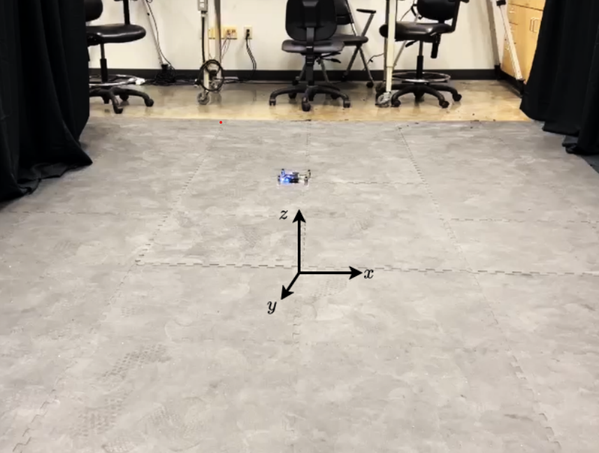
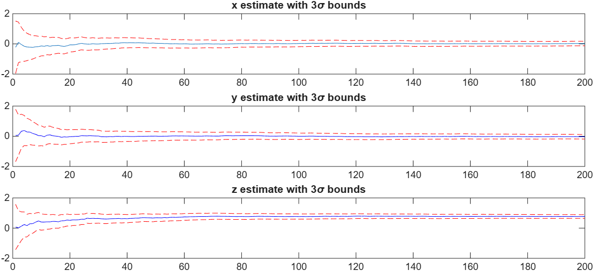

# Drone Position Estimation using Batch and Recursive Least Squares

This project estimates the position of a **Crazyflie drone** using noisy sensor measurements.

Two estimation methods were implemented in **MATLAB**:

- Batch Least Squares
- Recursive Least Squares (RLS)

The goal is to estimate the drone's constant position using measurements from two sensors.

---

## Problem Setup

Two sensors provide measurements:

**Sensor S1**
- Measures full position: (x, y, z)

**Sensor S2**
- Measures height only: (z)

A total of **200 synchronized measurements** were used to estimate the drone position.

Measurement noise follows Gaussian distributions.

---

## Experiment Setup

The Crazyflie drone hovers at a constant position while a motion capture system records the ground truth position.

---

## Estimation Results

The Recursive Least Squares estimator updates the position estimate sequentially as new measurements arrive.

The plots below show the estimated states with **3σ confidence bounds**.

The dashed red lines represent the **3σ uncertainty bounds** of the estimator.

The estimator converges to the Batch Least Squares solution as more measurements are processed.

